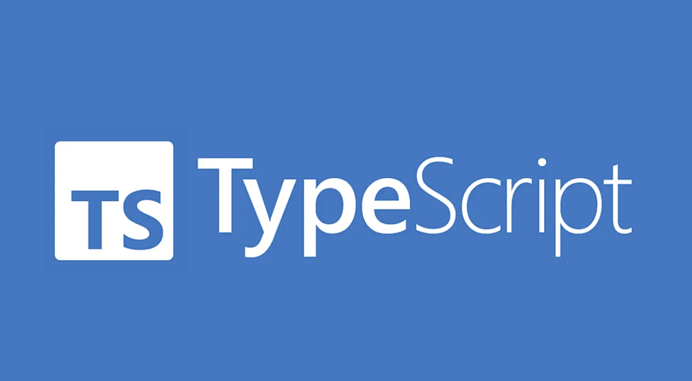

## Stepping into TypeScript

TypeScript is a programming language I began learning only a few weeks ago. Before this, my experience was limited to C, C++, and Java, so the idea of coding in a new language initially filled me with anxiety and uncertainty. However, contrary to my expectations, working through FreeCodeCamp and E36 helped me realize that Java and TypeScript share many similarities. Although there were some differences, the comfort that came from this familiarity boosted my confidence and motivation to continue learning TypeScript. 

## A Question so Clear, the Internet Wants to Help

After several weeks of exposure to TypeScript, I believe it is a strong programming language for software engineers - especially for beginners with a solid foundation in core concepts. As a newcomer to TypeScript, I often wrote code by relying on knowledge I had gained while learning Java. While TypeScript's strict typing initially felt challenging, I gradually recognized the value of early error detection. This feature encourages careful planning and improves code correctness, both of which are essential from a software engineering perspective. The structure and clarity provided by TypeScript also contribute to more maintainable code, making it particularly effective as projects grow in size and complexity. 

## When Vagueness Scares the Helpers Away
Throughout my experience learning TypeScript, I frequently relied on concepts from previous ICS courses, which reinforced the importance of WOD(Workout of the Day). WOD exercises require solving problems accurately within a limited time, helping me quickly identify the core requirements of a problem and plan the steps needed to implement a solution. Although working under time pressure was stressful at first, consistent practice through WOD helped me improve both my problem-solving efficiency and time management skills. This experience strengthened my ability to think clearly under constraints - and essential skill in real-world software development. 
