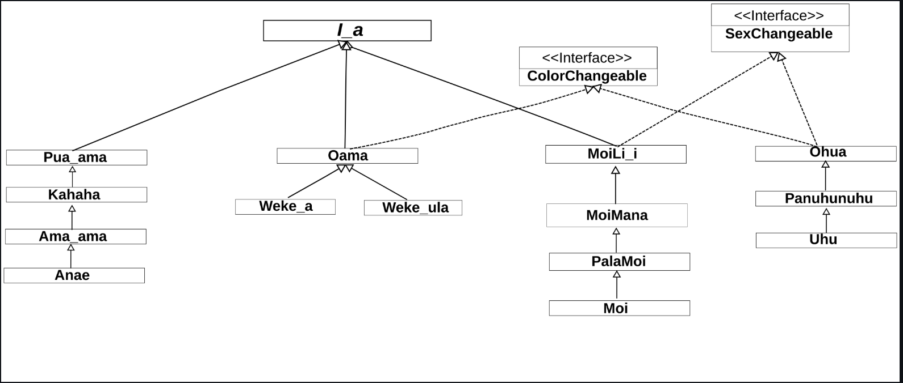

## What is I'a Quest

I'a Quest is a Java-based project that models Hawaiian fish and their life stages using object-oriented design. The name comes from i'a, the Hawaiian word for "fish", and the quest-style interaction built into the program: users must correctly answer a simple math question to trigger a fish's growth to its next life stage. The project uses inheritance, abstract classes, interfaces, and exceptions to represent multiple fish families - such as Moi, Ama'ama, Weke, and Uhu - each with evolving characteristics. 

## Object-oriented Design : Weke Family Inheritance
This project was completed by a team of three, and I was primarily responsible for the Weke fish family. I implemented all Weke-related classes - including the different life stages - ensuring they correctly extended the I_a abstract superclass and adhered to the UML specifications. My work included handling life-stage transitions, implementing required interfaces, and integrating custom exceptions related to size, color, and behavioral constraints specific to the Weke family. Throughout the project, I coordinated with my teammates to align design decisions across fish families and maintain a coherent overall class hierarchy. 

## Fish Life-Stage Modeling
This project strengthened my understanding of object-oriented design, particularly inheritance, abstraction, and interface-driven development. I gained hands-on experience using custom exceptions and JUnit tests to enforce domain rules and validate edge cases. Working within an existing codebase taught me how to interpret UML diagrams, follow documentation, and designe consistent, extensible class hierarhcies. The project also refinforeced the importance of thoughtful abstraction when modeling real-world and culturally grounded concepts in software. 

